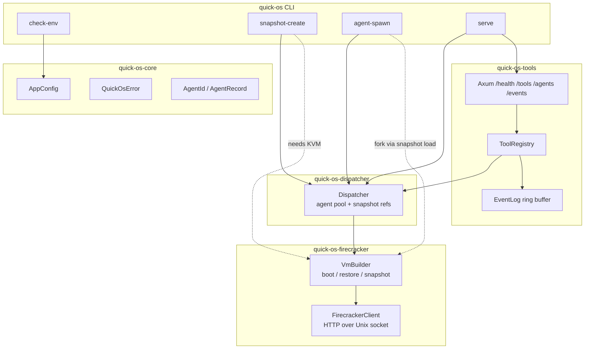
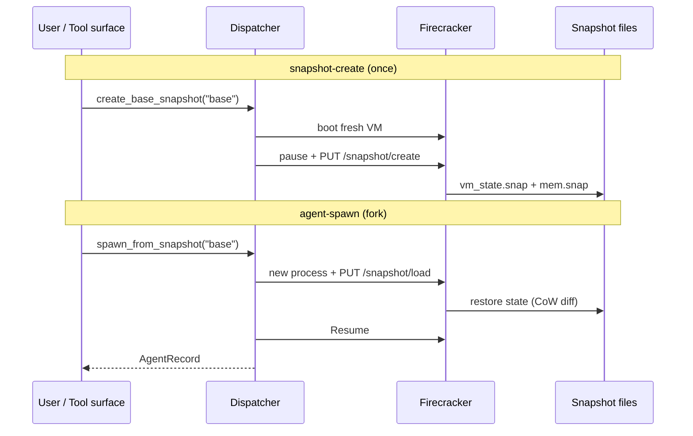

# quick-os — log de aprendizado

Projeto pessoal: agent dispatcher em Rust (Firecracker microVMs, snapshot/fork/restore, observable tool surface).

---

## Harness de review (mobile → PR)

**Como trabalhamos daqui em frente:**

1. **PR único** — `#4` / branch `cursor/quick-os-bb04`. Sem PRs novos.
2. **Diffs maiores** — sempre com **diagrama** (mermaid) explicando arquitetura/fluxo.
3. **Demo no terminal** — eu rodo e colo output aqui + no PR (você revisa pelo celular).
4. **Suas perguntas** — inline no PR; eu respondo lá ou na conversa.

**Script de demo (sem KVM):**

```bash
./scripts/demo-ci.sh
```

Roda: `cargo build`, CLI help, `check-env`, smoke tests HTTP, mostra config.

**O que só roda com KVM** (na tua máquina): `setup-dev.sh`, `snapshot-create`, `agent-spawn`, `serve` com VMs reais.

---

## Passos 1–5 (fundamentos Rust)

Cobertos na branch inicial: Cargo, `Result`, `?`, CLI args, `Option`, struct + ownership.
Ver histórico de commits `ce26e43..a057555`.

---

## Passo 6 — Scaffold completo do dispatcher

**O que construímos**

Workspace Cargo com 5 crates:

| Crate | Responsabilidade |
|-------|------------------|
| `quick-os-core` | `AppConfig`, `AgentId`, `SnapshotRef`, `QuickOsError` |
| `quick-os-firecracker` | HTTP client via Unix socket, boot/restore/snapshot VM |
| `quick-os-dispatcher` | Orquestra agents, fork via snapshot restore |
| `quick-os-tools` | Tool registry + Axum HTTP (`/tools`, `/agents`, `/events`) |
| `quick-os` | CLI: `check-env`, `snapshot-create`, `agent-spawn`, `serve` |

Ambiente de dev:

- `configs/quick-os.toml` — config runtime
- `scripts/setup-dev.sh` — download Firecracker, kernel Alpine, rootfs ext4
- `docker/docker-compose.yml` — dev container com `/dev/kvm` passthrough

**Conceito para lembrar**

> **Snapshot/fork** aqui é restore de microVM a partir de `vm_state.snap` + `mem.snap` — CoW via `enable_diff_snapshots: true` no load. Dispatcher não re-boota kernel; **restaura estado** e resume. Tool surface expõe cada operação como tool invocável + event log observável.

**Diagrama — arquitetura atual**



**Diagrama — fluxo snapshot / fork**



## Passo 7 — Pivot: agent-os guest runtime (Path A)

**O que construímos**
- Crate `agent-os` — runtime guest com primitivas v1
- `read_workspace` / `run_tool` / `emit_event`
- Protocolo `GuestRequest` / `GuestResponse` em `quick-os-core`
- Demo stdio: `./scripts/demo-agent-os.sh` (simula vsock, sem KVM)
- `docs/ARCHITECTURE.md` + diagrama sequência PNG

**Conceito para lembrar**
> **agent-os** é o produto vendável (Agent OS runtime). **quick-os** é host commodity (spawn + observe). Path B (kernel from scratch) fica Fase 3 opcional.

**Próximo**
- vsock bridge host ↔ guest
- pack agent-os no rootfs + golden snapshot
