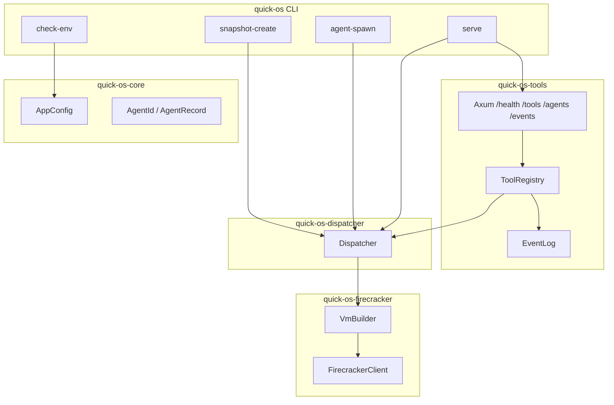
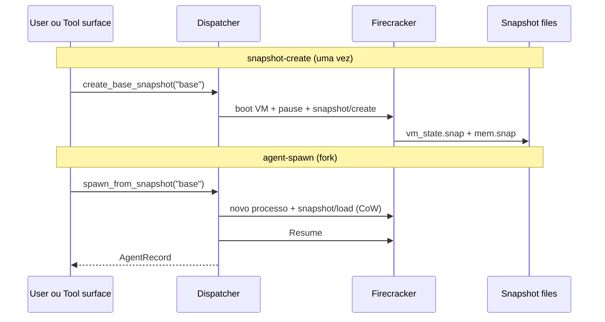

# PR #4 — Review guide (mobile-friendly)

> **Branch:** `cursor/quick-os-bb04` → `main`  
> **Commits:** 7 (learning steps 1–5 + full scaffold + demo harness)

Este arquivo existe porque a **descrição do PR no GitHub ficou desatualizada** (API do agent não consegue editar). **Tudo que importa está aqui e no diff.**

---

## O que mudou (TL;DR)

De um `main.rs` de tutorial → **workspace completo** de agent dispatcher:

| Crate | O que faz |
|-------|-----------|
| `quick-os-core` | Config TOML, errors, `AgentId`, `SnapshotRef` |
| `quick-os-firecracker` | Client HTTP via Unix socket, boot/restore/snapshot VM |
| `quick-os-dispatcher` | Pool de agents, spawn via snapshot load |
| `quick-os-tools` | Tool surface HTTP (Axum) + event log |
| `quick-os` | CLI binary |

+ `scripts/setup-dev.sh`, `scripts/demo-ci.sh`, `docker/`, `configs/quick-os.toml`

---

## Diagrama — arquitetura



---

## Diagrama — snapshot / fork



---

## Demo rodada (CI — sem KVM)

```text
════════════════════════════════════════
  BUILD
════════════════════════════════════════
    Finished `dev` profile [unoptimized + debuginfo] target(s)

════════════════════════════════════════
  CLI
════════════════════════════════════════
Usage: quick-os [OPTIONS] <COMMAND>

Commands:
  check-env        Validate host prerequisites
  snapshot-create  Boot a fresh VM and capture a base snapshot
  agent-spawn      Restore/fork an agent VM from snapshot
  serve            Run dispatcher + observable HTTP tool surface

════════════════════════════════════════
  CHECK-ENV (CI)
════════════════════════════════════════
  /dev/kvm:              MISSING      ← esperado no CI
  firecracker binary:    MISSING
  guest kernel:          MISSING
  guest rootfs:          MISSING

════════════════════════════════════════
  SMOKE TESTS (no KVM)
════════════════════════════════════════
test health_endpoint_returns_ok ... ok
test tools_endpoint_lists_builtin_tools ... ok
```

Reproduzir: `./scripts/demo-ci.sh`

---

## Onde olhar no diff (ordem sugerida)

1. **`REVIEW.md`** (este arquivo)
2. **`LOG.md`** — log de aprendizado + harness mobile/PR
3. **`README.md`** — quick start com KVM
4. **`crates/quick-os/src/main.rs`** — CLI entry
5. **`crates/quick-os-dispatcher/src/dispatcher.rs`** — orquestração
6. **`crates/quick-os-firecracker/src/vm.rs`** — lifecycle Firecracker
7. **`crates/quick-os-tools/src/server.rs`** — HTTP tool surface
8. **`scripts/demo-ci.sh`** — demo sem KVM

---

## Na tua máquina (com KVM)

```bash
./scripts/setup-dev.sh
cargo run -p quick-os -- check-env
cargo run -p quick-os -- snapshot-create --id base
cargo run -p quick-os -- serve
curl localhost:8080/tools
```

---

## Perguntas

Deixa inline **neste PR** — respondo no comment ou aqui no agent.
