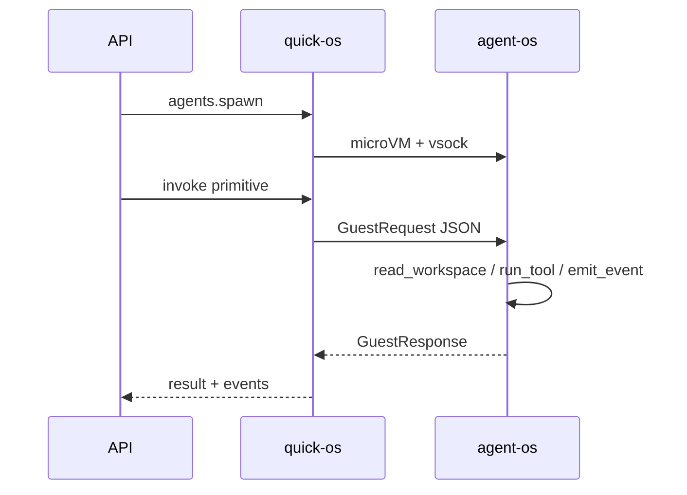

# PR #5 — Pivot: agent-os guest runtime

> **PR:** https://github.com/MatheusOliveiraSilva/quick-os/pull/5  
> **Branch:** `cursor/quick-os-dispatcher-bb04`

## O que mudou neste pivot

| Antes | Depois |
|-------|--------|
| "Dispatcher Firecracker" | **agent-os** = produto (runtime para agents) |
| Alpine guest genérico | **agent-os** Rust com primitivas v1 |
| Só host-side tools | Protocolo host↔guest (`GuestRequest` / `GuestResponse`) |

## Diagrama de sequência (abre no browser)

https://github.com/MatheusOliveiraSilva/quick-os/blob/cursor/quick-os-dispatcher-bb04/docs/images/agent-os-sequence.png

## Mermaid (GitHub mobile)



## Demo terminal (rodado no CI — copia output abaixo)

```bash
./scripts/demo-agent-os.sh
```

Ver output em: `docs/demo-output.txt` (gerado no commit)

## Ficheiros-chave deste pivot

| File | Why |
|------|-----|
| `crates/agent-os/` | Guest runtime ★ |
| `crates/quick-os-core/src/guest_protocol.rs` | Protocolo partilhado |
| `docs/ARCHITECTURE.md` | Plano completo Path A |
| `scripts/demo-agent-os.sh` | Demo sem KVM |

## Perguntas inline

Comenta neste PR — respondo aqui ou no thread.
