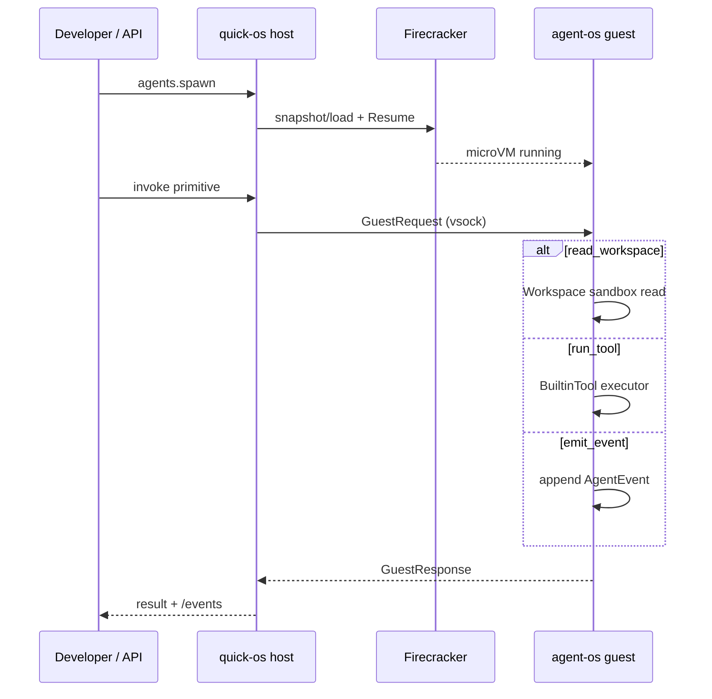
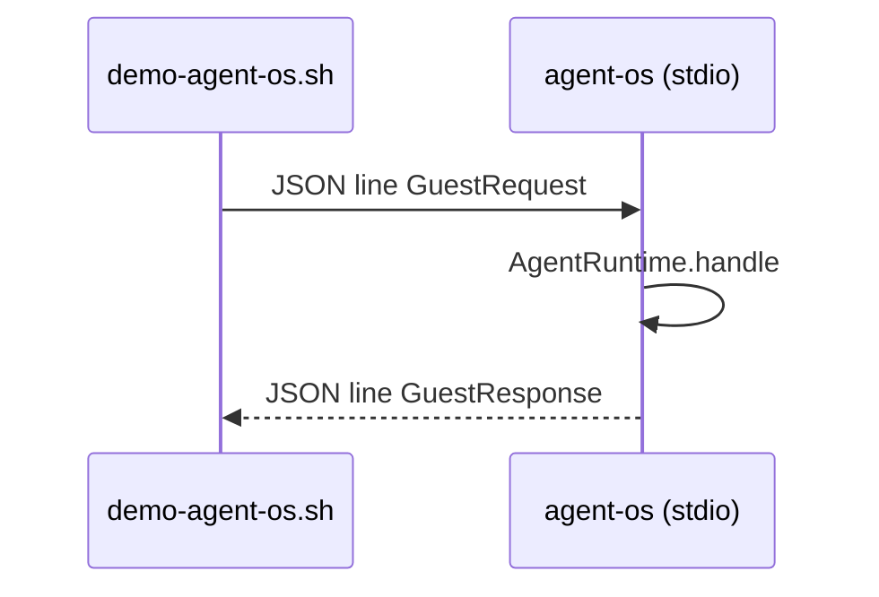

# Architecture — quick-os + agent-os

## Product reframe (pivot)

| Layer | Name | Role | Language |
|-------|------|------|----------|
| **Sellable** | **agent-os** | Agent operating environment — primitives, sandbox, events | Rust (guest) |
| Host | **quick-os** | Spawn, snapshot, bill, observe | Rust (host) |
| Commodity | Linux kernel + Firecracker | Isolation, KVM | — |

**Pitch:** *"Run agents on our Agent OS runtime — not generic Linux."*  
(Linux stays under the hood; customers buy the runtime + API.)

---

## v1 guest primitives

| Primitive | Request | Purpose |
|-----------|---------|---------|
| `read_workspace` | `{ "op": "read_workspace", "path": "..." }` | Sandboxed file read |
| `run_tool` | `{ "op": "run_tool", "name": "...", "input": {} }` | Deterministic tool execution |
| `emit_event` | `{ "op": "emit_event", "kind": "...", "payload": {} }` | Structured observability |

Protocol: `GuestRequest` / `GuestResponse` in `quick-os-core::guest_protocol`.

---

## Sequence — production path



PNG: [docs/images/agent-os-sequence.png](images/agent-os-sequence.png)

---

## Sequence — dev demo (no KVM)



Run: `./scripts/demo-agent-os.sh` or `cargo run -p quick-os -- demo-guest`

---

## Roadmap

### Phase 1 (now)
- [x] agent-os crate + v1 primitives
- [x] Guest protocol types
- [x] stdio demo (simulates vsock)
- [ ] Pack agent-os binary into guest rootfs

### Phase 2
- [ ] vsock host ↔ guest bridge in quick-os-dispatcher
- [ ] Golden snapshot with agent-os pre-started
- [ ] Replace Alpine placeholder rootfs

### Phase 3 (optional)
- [ ] Custom minimal kernel / unikernel research (Path B)

---

## Crate map

```
crates/
  agent-os/           ★ guest runtime (product)
  quick-os/           host CLI
  quick-os-dispatcher/
  quick-os-firecracker/
  quick-os-tools/     HTTP observability
  quick-os-core/      shared types + guest_protocol
```
